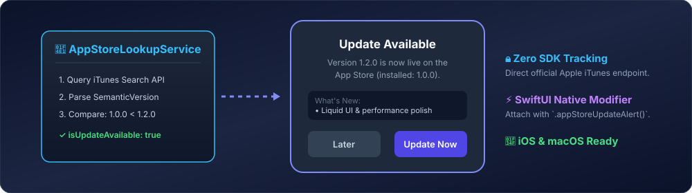

# AppStoreUpdateChecker 📲

A lightweight, privacy-focused Swift package for iOS & macOS that queries Apple's official iTunes Search API to detect newer App Store releases and present native SwiftUI update prompts.

[](https://swift.org)
[](https://developer.apple.com)
[](https://swift.org/package-manager/)
[](LICENSE)

<p align="center">
  
</p>

---

## 🌟 Key Advantages

- 🛡️ **Zero Tracking SDKs**: Communicates directly with Apple's official public endpoint (`https://itunes.apple.com/lookup`). No analytics frameworks or third-party servers required.
- 📦 **Pure Swift Concurrency**: Fully actor-isolated `AppStoreLookupService` built with modern `async/await` and `Sendable` types.
- 🔢 **Strict Semantic Versioning**: Accurately differentiates between patch updates (`1.0.0` vs `1.0.1`), feature updates, and major upgrades.
- 🎨 **Declarative SwiftUI Alert**: Simple `.appStoreUpdateAlert()` view modifier with direct deep-linking to the App Store product page.

---

## 🚀 Installation

Add **AppStoreUpdateChecker** to your dependencies in `Package.swift`:

```swift
dependencies: [
    .package(url: "https://github.com/nilkanthdesai76/swift-appstore-update-checker.git", from: "1.0.0")
]
```

Or add via Xcode: **File > Add Package Dependencies...** and paste the repository URL.

---

## 💻 Usage

### 1. Check for Updates Asynchronously

```swift
import AppStoreUpdateChecker

let service = AppStoreLookupService()

do {
    // Automatically uses Bundle.main.bundleIdentifier and CFBundleShortVersionString
    let update = try await service.checkForUpdate()

    if update.isUpdateAvailable {
        print("A newer version (\(update.storeVersion)) is available on the App Store!")
        print("Release Notes: \(update.releaseNotes ?? "N/A")")
    }
} catch {
    print("Update check error: \(error.localizedDescription)")
}
```

### 2. Display SwiftUI Update Prompt

```swift
import SwiftUI
import AppStoreUpdateChecker

struct RootContentView: View {
    @State private var showUpdateAlert = false
    @State private var updateInfo: UpdateInfo?
    private let checker = AppStoreLookupService()

    var body: some View {
        VStack(spacing: 20) {
            Text("Welcome to My App")
                .font(.title)
        }
        .task {
            if let info = try? await checker.checkForUpdate(), info.isUpdateAvailable {
                self.updateInfo = info
                self.showUpdateAlert = true
            }
        }
        .appStoreUpdateAlert(
            isPresented: $showUpdateAlert,
            updateInfo: updateInfo,
            title: "Update Available",
            updateButtonTitle: "Update Now",
            dismissButtonTitle: "Later"
        )
    }
}
```

---

## 🧪 Unit Testing

Run package tests via Swift CLI:

```sh
swift test
```

---

## 📄 License

This project is licensed under the MIT License - see the [LICENSE](LICENSE) file for details.
